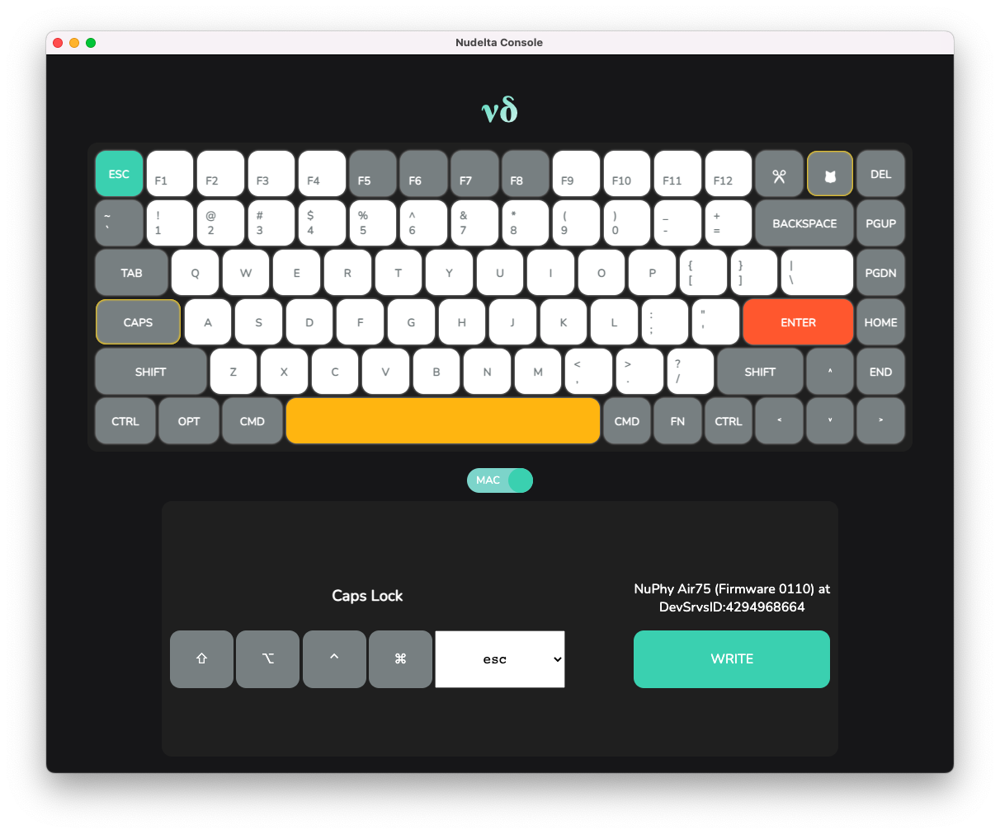

<h1 align="center"> ν∂ / nudelta </h1>

> Note: This software is in beta. Nudelta is an unofficial product and is not affiliated with NuPhy Studio.



A (WIP) open-source alternative to the [NuPhy Console](https://nuphy.com/pages/nuphy-console) for the [Air75 Mechanical Wireless Keyboard](https://nuphy.com/collections/keyboards/products/air75) by reverse-engineering the keyboard's USB protocol.

What this has:
* Support for NuPhy Air75 on Linux and macOS
    * Tested on Ubuntu 20.04, Manjaro and macOS 12.4 Monterey
* Loading and saving keymap modifications from a `.yml` configuration file
* The ability to back up and dump keymaps to binary formats (CLI)
* The ability to dump keymaps to a human-readable hex format (CLI)

What this DOESN'T have:
* Macros
    * Need to reverse engineer those.
* Support for Halo65/Air60
    * I don't have them.
* RGB Control
    * I don't need that, personally.


## Running Requirements
* An x86, x86_64 or Apple Silicon processor (w/ Rosetta)

### Build Requirements
* C++17 Compiler
* Cmake
* Node 14+ with Yarn

## Build (GUI)

```sh
git clone https://github.com/donn/nudelta
cd nudelta
git submodule update --init --recursive
rm -rf build
yarn
yarn build
```

The Linux AppImage will be found under ./dist, and the Mac app will be found under ./dist/mac.

## Build (CLI)
```sh
git clone https://github.com/donn/nudelta
cd nudelta
git submodule update --init --recursive
mkdir build
cd build
cmake ..
make -j$(nproc)
sudo make install
```

## CLI Usage

You will need to use **sudo** on Linux. On macOS, you will need to grant Input Monitoring permissions to whichever Terminal host you're using to run Nudelta, likely Terminal.app.

### Load a custom profile

```sh
nudelta -l ./donns_remap.yml
```

The configuration .yml file is simple: there's a top level object called "keys": which is a map of physical keys on the actual keyboard to their replacements:

```yml
keys:
    capslock: esc
```

See [example.yml](example.yml) for a profile and somewhat more detailed examples.

You can find a list of:
  * Replaceable keys in [res/air75_indices.yml](res/air75_indices.yml).
  * Replacement keycodes in [res/air75_keycodes.yml](res/air75_keycodes.yml).

### Reset keymap to default
```sh
nudelta -r
```

## License
The GNU General Public License v3 or, at your option, any later version. Check '[License](/License)'.

> NuPhy® is a registered trademark of NuPhy Studio.